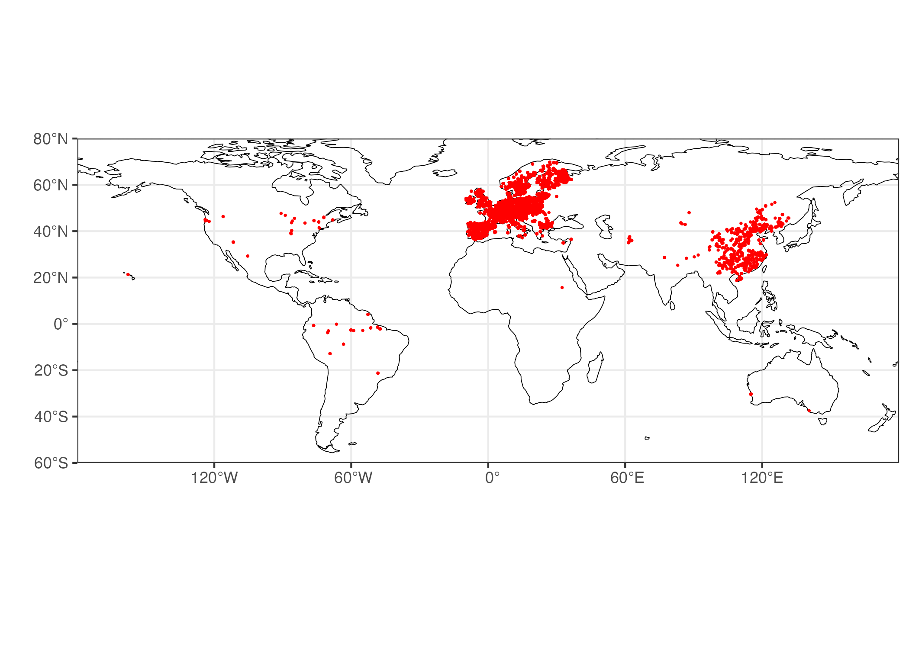
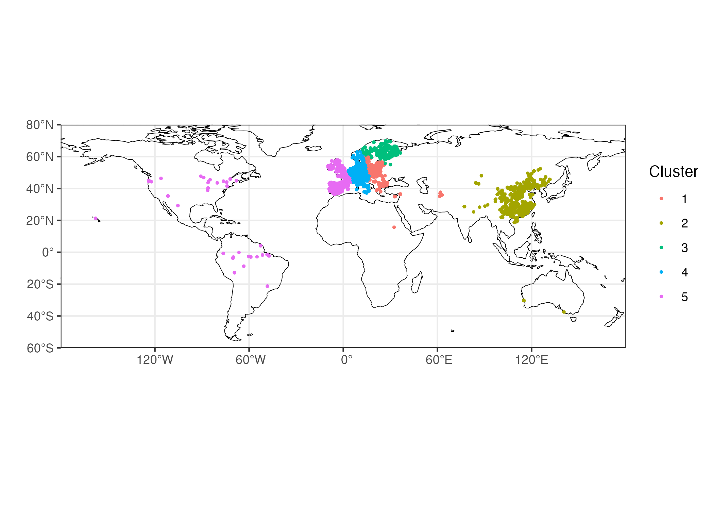
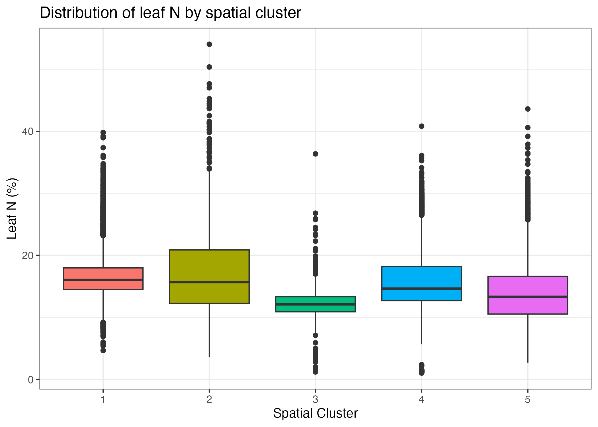
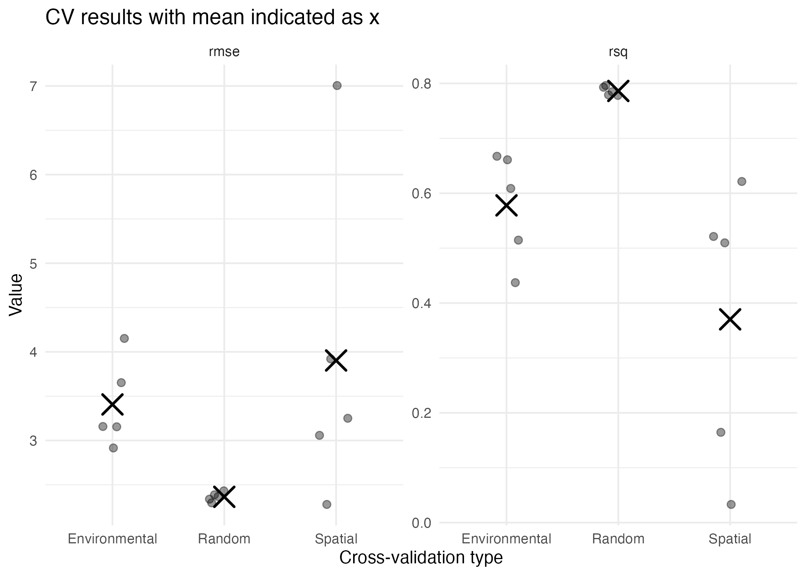

```{r setup, message=FALSE, warning=FALSE}
# Load libraries
library(tidyverse)
```
## Aim
This exercise aims to assess the impact of different cross-validation strategies (random, spatial and environmental) on the apparent predictive performance of a random forest model for predicting leaf nitrogen concentration.
## Data

```{r data-prep}
load("../data/leafN_prepared_data.RData")
skimr::skim(dfs)
```
## Methods
A random forest model (ranger) was trained using the following environmental predictors: elevation, climate, nitrogen deposition and management intensity, as well as species identity.
Three cross-validation strategies were compared:
Random CV: a random 5-fold split
Spatial CV: folds defined by geographic clusters
Environmental CV: folds defined in temperature–precipitation space.
The models performance was evaluated using R² and RMSE.

## Results
The results of the model performance are loaded and combined to do a comparison.

```{r}
random <- readRDS("../data/results_random_cv.rds")
spatial <- readRDS("../data/results_spatial_cv.rds")
```

```{r}

```
The data is not distributed uniformly over the globe. Especially over Europe and Asia are covered very densly whereas Africa and almost the whole southern hemisphere almost. don't exhibit any sampling points.
```{r}


environmental <- readRDS("../data/results_env_cv.rds")
knitr::include_graphics("../fig/environmental.png"
```

```{r}
results <- bind_rows(
random |> mutate(cv_type = "Random"),
spatial |> mutate(cv_type = "Spatial"),
environmental |> mutate(cv_type = "Environmental"))

results |>
group_by(cv_type) |>
summarise(
mean_rsq = mean(rsq, na.rm = TRUE),
mean_rmse = mean(rmse, na.rm = TRUE),
)



#The visual comparison below shows model performance across validation strategies.
```
#source("../analysis/03_make_plots.R")
## Discussion
Random cross-validation (CV) produces a high R² value and a lower root mean squared error (RMSE) because the data is randomly split. As nearby points are likely to be included in both the training and test sets, the model 'cheats' by predicting locations similar to the training points.
Spatial cross-validation (CV) shows lower R² and higher root mean squared error (RMSE), because test folds are geographically separate. This tests the model’s ability to predict in new regions, i.e. its spatial generalisation.
These differences highlight spatial overfitting.
Our model may perform well locally (random CV), but poorly in unobserved regions (spatial CV).
This emphasises the need for careful spatial validation when upscaling ecological data globally.


The results show that model performance varies significantly depending on the chosen cross-validation strategy.
The environmental cross-validation (CV) method omits clusters defined by mean annual temperature and precipitation rather than location.
The R² and RMSE values are intermediate: worse than random cross-validation (CV) because the model has to predict in unseen environmental conditions, but generally better than the worst spatial CV fold.
This makes sense: some environmental combinations are more common across regions, meaning the model can generalise to new areas as long as the environmental values overlap with those in the training set.
This tests the model's ability to generalise in environmental space, which is often more relevant for global predictions than purely spatial cross-validation.
